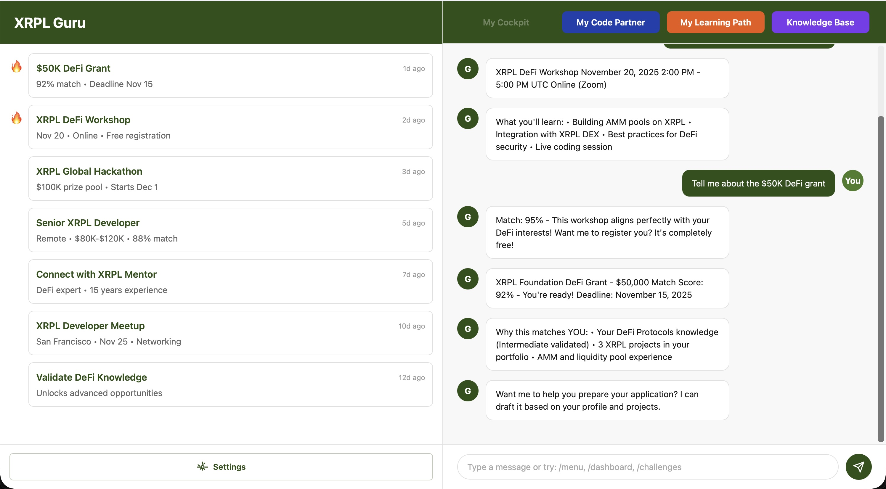
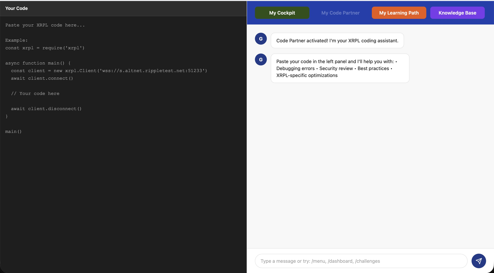
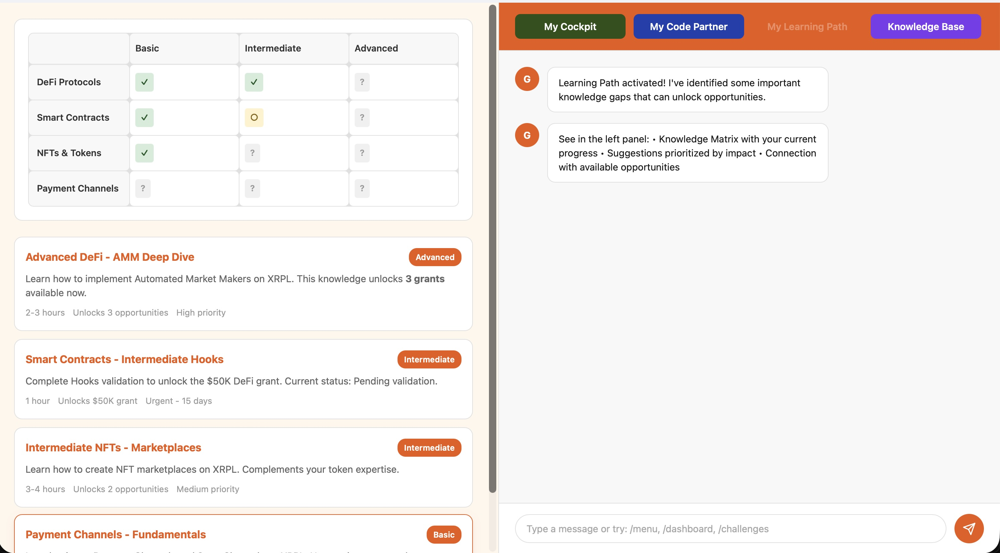
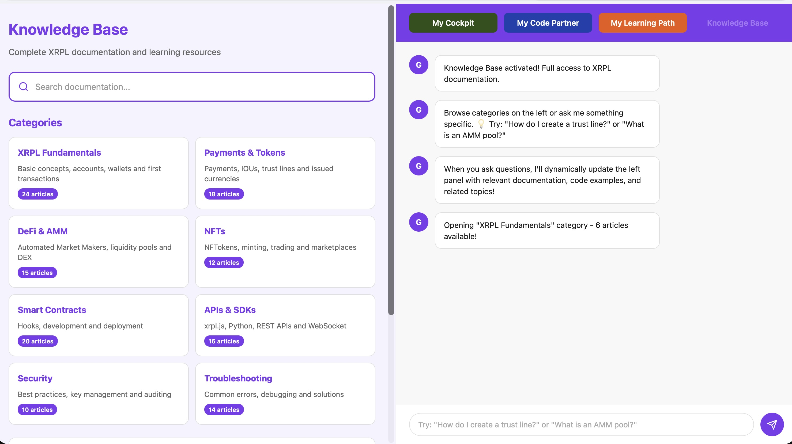
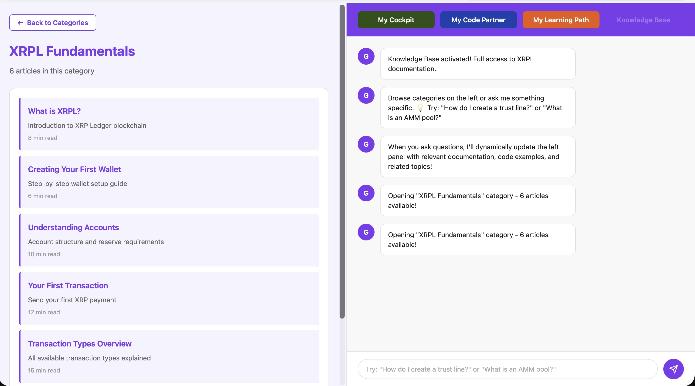

# XRPL Guru UX Design Specification

**Project:** XRPL Guru
**Date:** 2025-11-05
**Design System:** Chakra UI 2+
**Color Theme:** Earth Green
**Document Version:** 1.0 (Final)

---

## Executive Summary

This UX Design Specification defines the visual and interaction design for XRPL Guru, a proactive AI copilot for XRPL developers. The design emphasizes **simplicity, directness, and warmth** with a **chat-first, web-optional** strategy that positions the AI as a supportive partner rather than a corporate tool.

**Core Design Philosophy:**
- **Minimal and Direct:** Clean interface, no unnecessary elements, straight to the point
- **Warm but Professional:** Earth tones convey growth and support without being cold/corporate
- **Conversational by Default:** Natural language interaction as primary UX
- **Supportive, Not Pushy:** AI proactively suggests but respects user autonomy
- **Accessible to All:** WCAG 2.1 AA compliant, inclusive design

---

## 1. Design System Foundation

### 1.1 Design System Selection

**Primary System:** Chakra UI 2+

**Rationale:**
- ✅ Built-in accessibility (WCAG compliance out-of-the-box)
- ✅ Robust theming system (essential for expressing brand personality)
- ✅ TypeScript first-class support (aligns with tech stack)
- ✅ Composable components (flexible for dual chat + dashboard experience)
- ✅ Active community and excellent documentation

### 1.2 Customization Strategy

**Semantic Color Tokens:**
```typescript
// Opportunity States
opportunity.new → #2d5016 (Earth Green - natural discovery)
opportunity.relevant → #f4a261 (Terracota - high-match indicator)
opportunity.interested → #fbbf24 (Gold - user saved/exploring)
opportunity.applied → #4a7c28 (Light Green - progress tracking)

// Knowledge Matrix States
knowledge.validated → #4a7c28 (Validated competency)
knowledge.pending → #fbbf24 (Self-declared, awaiting validation)
knowledge.unknown → #e0e0e0 (Not assessed yet)
```

**Component Variant Extensions:**
- **OpportunityCard:** 3 cards horizontal layout with focus state
- **KnowledgeMatrix:** Interactive grid showing competency levels
- **ProgressIndicator:** Matrix completion visualization
- **ChatInterface:** Thread management, quick actions

**Motion System:**
- **Transitions:** Smooth, professional (200-300ms), minimal animations
- **State changes:** Subtle color shifts, no dramatic movements
- **Hover effects:** Gentle elevation (translateY -2px)
- **No confetti or celebrations:** Respects minimal aesthetic

**Typography Scale:**
- **Sans-serif primary:** System fonts for clean, modern feel
- **Monospace for code:** `'Courier New', monospace` for snippets
- **Hierarchy:** Clear but not excessive (3-4 sizes max)
- **Base size:** 16px (optimal readability, prevents iOS zoom)

---

## 2. Visual Foundation: Earth Green Palette

### 2.1 Color Palette

**Primary Colors:**
```css
/* Earth Green - Primary brand color */
--color-primary:       #2d5016;  /* RGB(45, 80, 22)  - Forest green, growth, organic */
--color-primary-light: #4a7c28;  /* RGB(74, 124, 40) - Hover states, highlights */
--color-primary-dark:  #1a3009;  /* RGB(26, 48, 9)   - Deep shadows */

/* Terracota - Accent color */
--color-accent:        #f4a261;  /* RGB(244, 162, 97) - Warm, opportunity, attention */
--color-accent-light:  #f7b885;  /* RGB(247, 184, 133) - Hover states */
```

**Semantic Colors:**
```css
/* Success, Validation */
--color-success:       #4a7c28;  /* Validated competencies, completed */

/* Warning, Pending */
--color-warning:       #fbbf24;  /* Pending validation, deadlines approaching */

/* Error, Destructive */
--color-error:         #dc2626;  /* Errors, failed validation */

/* Info, Neutral */
--color-info:          #2d5016;  /* General information */
```

**Neutral Palette (Light Mode - Primary):**
```css
/* Backgrounds */
--color-bg-base:       #fafafa;  /* RGB(250, 250, 250) - App background */
--color-bg-surface:    #ffffff;  /* RGB(255, 255, 255) - Cards, panels */
--color-bg-elevated:   #f8f8f8;  /* RGB(248, 248, 248) - Highlighted areas */

/* Borders */
--color-border-light:  #efefef;  /* RGB(239, 239, 239) - Subtle dividers */
--color-border:        #e0e0e0;  /* RGB(224, 224, 224) - Standard borders */
--color-border-strong: #2d5016;  /* RGB(45, 80, 22)   - Focus/active borders */

/* Text */
--color-text-primary:  #1a1a1a;  /* RGB(26, 26, 26)   - Headings, primary content */
--color-text-body:     #333333;  /* RGB(51, 51, 51)   - Body text */
--color-text-soft:     #666666;  /* RGB(102, 102, 102) - Secondary text */
--color-text-disabled: #999999;  /* RGB(153, 153, 153) - Disabled states */
```

### 2.2 Accessibility Compliance

**WCAG 2.1 Level AA Contrast Ratios:**
- ✅ Text Primary (#1a1a1a) on BG (#fafafa): **16.1:1** (AAA)
- ✅ Earth Green (#2d5016) on BG (#fafafa): **8.4:1** (AAA)
- ✅ Text Body (#333333) on Surface (#ffffff): **12.6:1** (AAA)
- ✅ Terracota (#f4a261) on BG (#fafafa): **4.8:1** (AA)

All interactive elements meet or exceed 3:1 contrast requirement.

### 2.3 Typography

**Font Families:**
```css
/* Primary Interface */
--font-sans: -apple-system, BlinkMacSystemFont, 'Segoe UI', Roboto,
             'Helvetica Neue', Arial, sans-serif;

/* Code & Technical */
--font-mono: 'Courier New', 'Monaco', monospace;
```

**Type Scale (Simplified - Minimal Aesthetic):**
```css
--text-sm:   0.85rem  (14px)   - Labels, metadata
--text-base: 1rem     (16px)   - Body text, inputs
--text-lg:   1.1rem   (18px)   - Card titles
--text-xl:   1.5rem   (24px)   - Section headers
--text-2xl:  2rem     (32px)   - Page headers (rare)
```

**Line Height:**
```css
--leading-tight:  1.4     - Headings
--leading-normal: 1.6     - Body text, cards
--leading-relaxed: 1.8    - Long-form content
```

**Font Weights:**
```css
--font-normal:    400
--font-semibold:  600
--font-bold:      700
```

### 2.4 Spacing System (8px Base Grid)

```css
--space-1:  0.25rem   (4px)
--space-2:  0.5rem    (8px)    - Base unit
--space-3:  0.75rem   (12px)
--space-4:  1rem      (16px)
--space-5:  1.25rem   (20px)
--space-6:  1.5rem    (24px)
--space-8:  2rem      (32px)
--space-10: 2.5rem    (40px)
```

### 2.5 Border Radius

```css
--radius-sm:  6px     - Tags, badges
--radius-md:  8px     - Buttons, inputs
--radius-lg:  12px    - Cards
--radius-full: 9999px - Pills, avatars
```

### 2.6 Shadows (Minimal - Subtle Elevation)

```css
--shadow-sm: 0 1px 3px rgba(0, 0, 0, 0.06);
--shadow-md: 0 4px 6px rgba(0, 0, 0, 0.08);
--shadow-lg: 0 8px 16px rgba(0, 0, 0, 0.1);

/* Colored shadows for emphasis (rare use) */
--shadow-green: 0 4px 12px rgba(45, 80, 22, 0.15);
```

---

## 3. Core Layout: Warm Minimal Timeline

### 3.1 Design Direction

**Selected:** Warm Minimal Timeline (Hybrid of Timeline + Minimal Focus)

**Core Characteristics:**
- ✅ **3 cards horizontal** - Main opportunities/updates side-by-side
- ✅ **90% width** - Maximizes screen real estate
- ✅ **Focus on primary card** - First card has green border (current priority)
- ✅ **History list below** - Compact chronological list of past items
- ✅ **No icons** - Text-only, clean and direct
- ✅ **Minimal chrome** - Header + content, no sidebars by default

### 3.2 Layout Structure

**Web Dashboard (Desktop):**
```
┌─────────────────────────────────────────────────────────────────┐
│  [XRPL Guru]                                    [Search]        │ Header (sticky)
├─────────────────────────────────────────────────────────────────┤
│                                                                 │
│  ┌──────────┐  ┌──────────┐  ┌──────────┐                     │
│  │ Card 1   │  │ Card 2   │  │ Card 3   │  ← 3 Cards Horizontal
│  │ (Focus)  │  │          │  │          │     (90% width)
│  │ Green    │  │ Gray     │  │ Gray     │
│  │ border   │  │ border   │  │ border   │
│  └──────────┘  └──────────┘  └──────────┘                     │
│                                                                 │
│  ┌───────────────────────────────────────┐                     │
│  │ Histórico                             │  ← History List
│  │ • Item 1 - há 3 dias                  │     (compact)
│  │ • Item 2 - há 5 dias                  │
│  │ • Item 3 - há 1 semana                │
│  └───────────────────────────────────────┘                     │
│                                                                 │
└─────────────────────────────────────────────────────────────────┘

90% width container
Centered on page
```

**Mobile (Responsive):**
```
┌─────────────────────┐
│  [XRPL Guru]   [🔍] │ Header
├─────────────────────┤
│                     │
│  ┌───────────────┐  │
│  │ Card 1 (Focus)│  │ Cards stack
│  │ Green border  │  │ vertically
│  └───────────────┘  │
│                     │
│  ┌───────────────┐  │
│  │ Card 2        │  │
│  └───────────────┘  │
│                     │
│  ┌───────────────┐  │
│  │ Card 3        │  │
│  └───────────────┘  │
│                     │
│  ┌───────────────┐  │
│  │ Histórico     │  │
│  │ • Item 1      │  │
│  └───────────────┘  │
└─────────────────────┘
```

### 3.3 Card Anatomy

**Standard Card:**
```
┌────────────────────────────────┐
│ há 2 horas          92% Match  │ ← Meta (time + badge)
│                                │
│ Grant Title Here               │ ← Title (1.1rem, bold)
│                                │
│ Brief description of the       │ ← Description (0.9rem)
│ opportunity in 1-2 lines       │
│                                │
│ ┌────────────────────────────┐ │
│ │ Why this matches you:      │ │ ← Highlight box
│ │ Your skills align...       │ │   (gray bg, green border-left)
│ └────────────────────────────┘ │
│                                │
│ [Explorar]                     │ ← Actions (stacked vertically)
│ [Salvar]                       │
│ [Dispensar]                    │
└────────────────────────────────┘

Border: 1px solid #e0e0e0 (default)
Border: 1px solid #2d5016 (focus/hover)
Padding: 24px
Border-radius: 12px
```

---

## 4. User Journey Flows (Updated for Knowledge Matrix)

### 4.1 Journey 1: Onboarding - First Contact to Knowledge Assessment

**Entry Point:** Developer connects via Slack/Discord/WhatsApp or web dashboard

**Flow:**
1. **Welcome & Platform Selection**
   - AI: "Welcome! I'm XRPL Guru, your partner in the XRPL ecosystem."

2. **Profile Building (Conversational)**
   - AI: "Tell me about your development experience."
   - User shares background (free-form)
   - AI extracts skills, experience level, interests

3. **Goal Discovery**
   - AI: "What brings you to XRPL?"
   - User selects: Learn, Build, Apply for grants, Get job

4. **Knowledge Assessment (Matrix-Based)**
   - AI: "I see you mentioned DeFi experience. Have you worked with AMMs or liquidity pools?"
   - User: "Yes, I built a Uniswap fork"
   - AI: ✅ Validates "DeFi Protocols - Intermediário" in matrix
   - AI: "What about XRPL specifically - have you used it before?"
   - User: "No, brand new"
   - AI: ✅ Marks "XRPL Fundamentals - Básico" as pending

5. **Matrix Initialization**
   - AI shows initial matrix state: validated cells, pending cells, unknown cells
   - AI: "Based on our chat, you're strong in DeFi but new to XRPL. Let me show you what's different about XRPL's approach..."

6. **Proactive Settings**
   - AI: "I can notify you about grants and opportunities. How often?"
   - User sets preference

**Exit Point:** User has Knowledge Matrix initialized, preferences set, ready for content

**Key Decision Points:**
- Self-declare existing knowledge vs. start from scratch
- Assessment depth (quick vs. thorough)
- Proactive notification frequency

**Web Dashboard Elements:**
- Knowledge Matrix visualization (cells colored by status)
- % Matrix complete
- "Next competency to unlock opportunities" suggestion

---

### 4.2 Journey 2: Daily Discovery - Proactive Opportunity Matching

**Entry Point:** AI detects opportunity match in background

**Flow:**
1. **Opportunity Match Detection (Background)**
   - AI checks: Opportunity requirements vs. Developer's validated matrix cells
   - Example: Grant requires "DeFi Protocols - Intermediário" + "Smart Contracts - Básico"
   - Developer has: "DeFi Protocols - Intermediário" ✅ + "Smart Contracts - ?" ❌
   - Match score: 50% (1/2 requirements met)
   - **Decision:** Not ready yet, mark as "potential future match"

2. **Competency Gap Identified**
   - AI (proactive): "I found a $50K DeFi grant, but it requires Smart Contracts knowledge. Want to validate that skill?"
   - User: "I know basics"
   - AI: "Great! Let me ask a quick question to confirm..."
   - AI validates through conversation
   - ✅ "Smart Contracts - Básico" validated
   - Match score: 100% (2/2 requirements met)

3. **Proactive Notification (Now Ready)**
   - AI: "You're now qualified for that $50K DeFi grant! It opens next week. Want to explore?"
   - Shows opportunity card with match explanation

4. **Decision Point**
   - **Interested → Prepare:** AI helps draft application
   - **Save:** Added to saved opportunities
   - **Dismiss:** AI learns preferences

**Exit Point:** Opportunity explored or saved, matrix updated

**Personality:** Exciting discovery, empowering ("you're now ready"), not pushy

---

### 4.3 Journey 3: Knowledge Matrix - Continuous Validation

**Entry Point:** Developer asks technical question or discusses project

**Flow:**
1. **Natural Conversation Context**
   - User: "How do I implement payment channels on XRPL?"
   - AI: [Detects topic: Payment Channels]
   - AI checks matrix: "Payment Channels" = all cells "Unknown"

2. **Conversational Assessment**
   - AI: "Payment channels are advanced. Have you worked with similar concepts (Lightning Network, state channels)?"
   - User: "No, never heard of them"
   - AI: ✅ Infers "Payment Channels - Básico" = not yet
   - AI: "Let me explain the basics first..."

3. **Content Delivery (Gap-Focused)**
   - AI delivers ONLY what user doesn't know
   - Explains payment channels from scratch
   - Provides code example
   - User tries implementation

4. **Validation Through Practice**
   - User: "I got this error..."
   - AI helps debug
   - AI: [Observes understanding level through questions asked]
   - After successful implementation:
   - AI: ✅ Validates "Payment Channels - Básico"
   - AI: "Great! You just unlocked 2 grants that need payment channel knowledge."

5. **Matrix Update**
   - Dashboard shows new validated cell
   - Progress % increases
   - New opportunities appear in pipeline

**Exit Point:** Competency validated, matrix updated, new opportunities unlocked

**Key Difference from Courses:**
- No formal test or "module completion"
- Validation happens naturally through help-seeking and problem-solving
- User never feels "stuck in a course" - just learning what's needed

---

### 4.4 Journey 4: Code Partner - Conversational Coding Assistance

**Entry Point:** Developer encounters coding problem or needs technical help

**Flow:**
1. **Problem Initiation (Any Channel)**
   - User messages via WhatsApp/Discord/Slack: "I'm getting tecNoPathToDestination error"
   - AI detects technical question, switches to Code Partner mode
   - AI: "That error means no trust line configured. Show me your code?"

2. **Context Gathering**
   - User shares code snippet (Python/JavaScript)
   - AI analyzes code, identifies issue
   - AI checks developer's current project context from previous conversations
   - AI: "I see you're working on the payment gateway project - this is for USD tokens, right?"

3. **Solution Delivery**
   - AI provides specific fix with code example
   - AI explains WHY it's broken and HOW to fix it
   - AI offers two approaches: quick fix vs. best practice
   - Code formatted for easy copy-paste

4. **Security & Best Practices Check**
   - AI proactively identifies security issues in shared code
   - AI: "⚠️ Security tip: Always validate issuer before creating trust line"
   - AI suggests optimizations (gas/fee reduction)

5. **Learning Moment**
   - After solution: AI asks "Want me to explain trust lines in detail?"
   - If yes: AI provides brief explainer + links to XRPL docs (via Ripple RAG)
   - If no: AI stands by for next question

6. **Competency Update**
   - AI silently updates Knowledge Matrix based on interaction
   - Example: If developer fixed trust line issue → validates "Payments - Intermediário"

**Exit Point:** Problem solved, developer can continue coding, matrix updated

**Chat-Specific Interactions:**
- **WhatsApp:** Plain text code, link to full examples
- **Discord:** Rich code blocks with syntax highlighting
- **Slack:** Interactive buttons for "Show full example" / "Explain more"

**Personality:** Helpful coding buddy, patient, never condescending, celebrates wins

---

### 4.5 Journey 5: Empower Loop - Gamified Challenges & Progression

**Entry Point:** Daily challenge notification OR developer requests challenge

**Flow:**
1. **Challenge Delivery (Proactive)**
   - AI sends morning notification (9 AM developer's timezone)
   - AI: "🎯 Daily Challenge: DeFi Builder - Create AMM pool on Testnet"
   - Shows: Difficulty (⭐⭐⭐), Reward (+50 XP, "Liquidity Provider" badge), Estimated time (30 min)

2. **Challenge Acceptance**
   - Developer clicks "Accept challenge"
   - AI provides step-by-step guidance (not full solution)
   - AI: "Step 1: Create custom token. Need help or want to try yourself first?"
   - Developer controls pace: can ask for hints or try independently

3. **Progress Tracking**
   - Developer messages updates: "Created token RTK!"
   - AI validates progress: "✅ Step 1 complete. Ready for Step 2?"
   - AI adapts difficulty if developer struggles (offers more hints)

4. **Completion & Rewards**
   - Developer completes challenge
   - AI: "🎉 Challenge Complete! +50 XP, Badge earned: Liquidity Provider 💧"
   - AI: "Total XP: 350 (Level 4). Next milestone: 650 XP for 'DeFi Expert'"

5. **Streak Tracking**
   - AI: "🔥 5-day streak! Keep it up!"
   - If streak breaks: AI gently reminds but doesn't guilt-trip
   - AI: "New challenge available tomorrow at 9 AM"

6. **Social Features (Optional)**
   - AI: "3 other developers completed this challenge today. Want to see their approaches?"
   - Leaderboard opt-in: "You're #47 in Brazil, #234 globally"

**Exit Point:** Challenge completed, XP gained, new competency validated, next challenge queued

**Web Dashboard Integration:**
- View all available challenges (not just daily)
- Filter by difficulty, topic, time commitment
- See badge collection, XP history graph

**Personality:** Encouraging coach, celebrates progress, never pushy about streaks

---

### 4.6 Journey 6: Market Bridge - Jobs, Mentors, Startup Connections

**Entry Point:** AI detects match OR developer requests via command (/jobs, /mentors, /startups)

**Flow A: Job Match (Proactive)**
1. **Match Detection (Background)**
   - AI monitors XRPL job boards, startup postings
   - Matches developer skills + location + interests
   - Match score ≥85%: AI sends notification

2. **Proactive Notification**
   - AI: "💼 Job Match! Senior XRPL Developer - DeFi Focus, $80K-$120K, Remote (Brazil OK)"
   - Shows match breakdown: "88% match - your DeFi skills + 3 XRPL projects + location"

3. **Application Preparation**
   - Developer: "Tell me more"
   - AI provides: Company background, role details, requirements
   - AI: "Want me to prepare your application? I'll use your portfolio + validated skills"
   - Developer: "Yes"
   - AI drafts cover letter, highlights relevant projects, prepares resume talking points

4. **Connection Facilitation**
   - AI: "Ready to apply. I can submit directly or you can review/edit first?"
   - Developer reviews, makes tweaks
   - AI submits application, sets reminder to follow up in 1 week

**Flow B: Mentor Matching (On-Demand)**
1. **Request Initiation**
   - Developer: "/mentors" or "I need a mentor for DeFi"
   - AI: "Looking for DeFi mentors in XRPL ecosystem..."

2. **Match Presentation**
   - AI shows 2-3 top matches with:
     - Name, expertise, availability (hours/week)
     - Why they're a good match (complementary skills vs. same focus)
     - Mentor bio + past mentees' success stories

3. **Introduction**
   - Developer: "Connect me with Marcus Chen"
   - AI: "I'll intro you. What do you want to learn from Marcus?"
   - Developer provides context
   - AI sends warm introduction email/message to mentor with developer's background
   - AI: "Introduction sent! Marcus usually responds within 2 days."

4. **Follow-up**
   - AI checks in after 3 days: "Heard back from Marcus?"
   - If no response: AI offers alternative mentor
   - If yes: AI asks "How was the session? Need to schedule next one?"

**Flow C: Startup Discovery**
1. **Exploration**
   - Developer: "/startups"
   - AI: "🚀 XRPL Startups Seeking Talent (2 matches for your profile)"

2. **Startup Profiles**
   - Shows: Stage (Seed/Pre-seed), funding, focus area, what they're building, what role they need
   - Match reason: "Your DeFi expertise perfect for LiquidX's cross-chain aggregator"

3. **Connection**
   - Developer expresses interest
   - AI: "LiquidX is led by Sarah (ex-Ripple engineer). Want intro?"
   - AI facilitates warm introduction with founder
   - AI: "Connecting you with Sarah. She's looking for a lead DeFi engineer or potential co-founder."

**Exit Point:** Job applied, mentor connected, startup introduction made

**Personality:** Professional networker, warm introducer, respects developer's time and interest level

---

### 4.7 Journey 7: Impact Dashboard - Progress Visualization & Portfolio

**Entry Point:** Developer requests dashboard (/dashboard, /portfolio) OR periodic AI summary

**Flow A: Progress Dashboard (Chat-Based)**
1. **Request**
   - Developer: "/dashboard"
   - AI: "📊 Your Impact Dashboard - Last updated: today"

2. **Summary Delivery (Conversational Format)**
   - AI presents in chat-optimized format:
     ```
     🎯 Progress:
     • Knowledge Matrix: 75% complete
     • XP: 350 (Level 4)
     • Streak: 5 days 🔥

     ✅ Skills Validated (8):
     • DeFi Protocols - Avançado
     • Smart Contracts - Intermediário
     [...]

     🚀 Projects (3):
     • AMM Liquidity Pool (Nov 2025)
     • NFT Marketplace (Oct 2025)
     [...]

     📈 Opportunities Pipeline (4):
     • $50K DeFi Grant (under review)
     • Senior Dev Job @ LiquidX (88% match)
     [...]
     ```

3. **Interactive Exploration**
   - AI: "Want details on any section?"
   - Developer can drill down: "Show me badge collection"
   - AI provides details conversationally

4. **Export Options**
   - AI: "Export to CV? Share portfolio link?"
   - Developer can request PDF resume, LinkedIn-formatted summary, public portfolio link

**Flow B: Portfolio Builder (Web + Chat Hybrid)**
1. **Portfolio Creation Request**
   - Developer: "/portfolio"
   - AI: "🎨 I created your XRPL portfolio: xrplguru.dev/@your-username"

2. **What's Included**
   - AI: "Your portfolio includes:"
     - Professional bio (auto-generated from profile)
     - 3 XRPL projects with descriptions, screenshots, GitHub links
     - Validated skills with badges
     - Contribution history to XRPL ecosystem
     - Contact info (optional)

3. **Customization**
   - AI: "Want to edit anything?"
   - Developer can request changes via chat:
     - "Update bio to mention my Ethereum background"
     - "Add my hackathon win"
     - "Remove Project X"
   - AI makes changes, confirms: "Updated! Check the link."

4. **Sharing**
   - AI: "Share this with recruiters, grant committees, or XRPL community"
   - Portfolio is public URL, SEO-optimized
   - AI tracks views (analytics): "Your portfolio had 23 views this week"

**Flow C: Proactive Progress Updates**
1. **Weekly Summary (Sunday evening)**
   - AI: "📊 Weekly Wrap-Up: Great progress this week!"
   - Highlights: XP gained, skills validated, challenges completed, opportunities engaged
   - AI: "Next week goal: Validate 2 more skills to unlock 5 new grants"

2. **Milestone Celebrations**
   - When hitting major milestone (Level up, Matrix 100%, etc.)
   - AI: "🎉 Milestone Achieved: DeFi Expert! You're now in top 10% of XRPL developers."
   - AI shares achievement to community (opt-in): "Want me to share in #wins channel?"

**Exit Point:** Developer sees full progress, portfolio shared, motivation boosted

**Web Dashboard Role:**
- Visual graphs of progress over time (XP curve, skills heatmap)
- Interactive Knowledge Matrix with drill-down
- Portfolio builder with drag-drop customization
- Analytics deep-dive (opportunity funnel, time invested, ROI)

**Personality:** Supportive cheerleader, data-driven, celebrates progress without being over-the-top

---

## 5. Component Library Strategy

### 5.1 Core Components (Minimal Set)

**Navigation Components:**
- `<Header>` - Logo + Search, sticky top
- `<MobileNav>` - Bottom tab bar (mobile only)

**Content Components:**
- `<OpportunityCard>` - Standard 3-card layout
- `<HistoryList>` - Compact chronological list
- `<KnowledgeMatrix>` - Interactive grid showing competencies
- `<MatrixCell>` - Individual competency (topic × level)

**Chat Components:**
- `<ChatContainer>` - Main chat interface
- `<MessageBubble>` - AI vs. User variants
- `<QuickReply>` - Suggested action buttons

**Form Components:**
- `<Input>` - Text fields (minimal styling)
- `<Button>` - Primary, Secondary, Ghost variants

**Feedback Components:**
- `<Toast>` - Success/error notifications (rare use)
- `<EmptyState>` - Onboarding-focused empty states

### 5.2 Knowledge Matrix Components

**Matrix Grid:**
```tsx
<KnowledgeMatrix>
  <MatrixRow topic="DeFi Protocols">
    <MatrixCell level="basic" status="validated" />
    <MatrixCell level="intermediate" status="validated" />
    <MatrixCell level="advanced" status="unknown" />
  </MatrixRow>
  <MatrixRow topic="Smart Contracts">
    <MatrixCell level="basic" status="pending" />
    <MatrixCell level="intermediate" status="unknown" />
    <MatrixCell level="advanced" status="unknown" />
  </MatrixRow>
</KnowledgeMatrix>
```

**Cell States:**
- `validated` - Green background (#4a7c28), "✓" icon
- `pending` - Yellow background (#fbbf24), "○" icon
- `unknown` - Gray background (#e0e0e0), "?" icon

**Hover Interaction:**
- Shows tooltip: "Validated via [method]" or "Self-declared, pending validation"
- Click: Opens detail modal with evidence and timeline

---

## 6. UX Pattern Decisions

### 6.1 Button Hierarchy

**Primary Action Button:**
```css
background: #2d5016;
color: #ffffff;
padding: 10px 20px;
border-radius: 6px;
font-weight: 600;
border: none;

hover:
  background: #4a7c28;
  transform: translateY(-2px);
```

**Secondary Action Button:**
```css
background: transparent;
color: #2d5016;
padding: 10px 20px;
border: 2px solid #2d5016;
border-radius: 6px;
font-weight: 600;

hover:
  background: #2d5016;
  color: #ffffff;
```

**Ghost Button:**
```css
background: transparent;
color: #666666;
padding: 10px 20px;
border: none;

hover:
  color: #2d5016;
```

### 6.2 Form Patterns

**Input Fields:**
```css
background: #ffffff;
border: 1px solid #e0e0e0;
border-radius: 8px;
padding: 12px 16px;
color: #1a1a1a;

focus:
  border: 2px solid #2d5016;
  outline: none;

error:
  border: 2px solid #dc2626;
```

**Validation:**
- Inline validation (debounced 500ms)
- Helpful error messages ("Use format: name@example.com")
- No aggressive red highlighting until submit attempt

### 6.3 Card Patterns

**3-Card Horizontal Layout:**
```css
.cards-section {
  display: grid;
  grid-template-columns: repeat(3, 1fr);
  gap: 20px;
  max-width: 90%;
  margin: 0 auto;
}

.card {
  background: #ffffff;
  border: 1px solid #e0e0e0;
  border-radius: 12px;
  padding: 24px;
  transition: all 0.2s;
}

.card:hover {
  border-color: #2d5016;
  box-shadow: 0 4px 12px rgba(45, 80, 22, 0.08);
}

.card.focus {
  border-color: #2d5016;
}

@media (max-width: 1024px) {
  .cards-section {
    grid-template-columns: 1fr;
  }
}
```

### 6.4 History List Pattern

```css
.history-list {
  background: #ffffff;
  border-radius: 12px;
  padding: 24px 32px;
  margin-top: 40px;
}

.history-item {
  padding: 16px 0;
  border-bottom: 1px solid #f0f0f0;
  display: flex;
  justify-content: space-between;
  cursor: pointer;
  transition: all 0.2s;
}

.history-item:hover {
  padding-left: 8px;
  color: #2d5016;
}
```

### 6.5 Knowledge Matrix Pattern

**Matrix Table:**
```css
.matrix-table {
  width: 100%;
  border-collapse: collapse;
}

.matrix-table th {
  background: #f8f8f8;
  padding: 12px;
  text-align: left;
  font-weight: 600;
  border: 1px solid #e0e0e0;
}

.matrix-table td {
  padding: 16px 12px;
  border: 1px solid #e0e0e0;
}

.skill-level {
  display: inline-block;
  padding: 6px 12px;
  border-radius: 6px;
  font-size: 0.85rem;
  font-weight: 600;
}

.skill-level.validated {
  background: #d4edda;
  color: #155724;
}

.skill-level.pending {
  background: #fff3cd;
  color: #856404;
}

.skill-level.unknown {
  background: #f0f0f0;
  color: #999999;
}
```

---

## 7. Responsive Design & Accessibility

### 7.1 Responsive Breakpoints

```typescript
breakpoints = {
  base: '0px',      // Mobile (320px+)
  sm: '480px',      // Large mobile
  md: '768px',      // Tablet
  lg: '992px',      // Desktop
  xl: '1280px',     // Large desktop
}
```

**Layout Adaptations:**
- **Mobile (base-767px):** Cards stack vertically, history collapses
- **Tablet (768-1023px):** 2 cards per row
- **Desktop (1024px+):** 3 cards horizontal (approved layout)

### 7.2 Accessibility (WCAG 2.1 AA)

**Keyboard Navigation:**
- All interactive elements Tab-focusable
- Skip link: "Skip to main content"
- Focus indicators: 2px solid #2d5016 outline

**Screen Readers:**
- Semantic HTML (`<main>`, `<nav>`, `<article>`)
- ARIA labels for icon-only buttons
- Alt text for images
- Live regions for dynamic content

**Color & Contrast:**
- All text meets 4.5:1 minimum
- Interactive elements meet 3:1 minimum
- Non-color indicators (icons + text, not just color)

---

## 8. Implementation Guidelines

### 8.1 Development Priorities

**Phase 1: Foundation (Week 1)**
- Chakra UI theme with Earth Green colors
- Header + 3-card layout (90% width)
- Basic Knowledge Matrix grid
- Responsive breakpoints

**Phase 2: Core Components (Week 2)**
- Opportunity cards with all states
- History list component
- Interactive Matrix with cell states
- Form components (input, buttons)

**Phase 3: Interactions (Week 3)**
- Hover/focus states
- Card click-through flows
- Matrix cell tooltips
- Mobile responsive polish

**Phase 4: Accessibility (Week 4)**
- WCAG AA audit
- Keyboard navigation
- Screen reader testing
- Color contrast validation

### 8.2 Design Handoff

**For Developers:**
- ✅ Figma file with all screens (or HTML prototypes as reference)
- ✅ Chakra UI theme config (colors, typography, spacing)
- ✅ Component specifications
- ✅ Responsive behavior documentation
- ✅ Accessibility requirements

**For QA:**
- ✅ User journey flows
- ✅ WCAG AA testing checklist
- ✅ Cross-browser matrix
- ✅ Responsive device testing

---

## 9. Visual Assets

**Generated Artifacts:**
1. `ux-warm-minimal.html` - Initial color exploration (4 palettes)
2. `ux-final-clean.html` - **Approved layout** (Earth Green, 3 cards, 90% width)
3. `learning-matrix-strategy.html` - Knowledge Matrix strategy and examples

**To Be Created (Design Phase):**
- Figma design file with all screens
- Component library in Storybook
- Knowledge Matrix interactive prototype
- Empty state illustrations

---

## 10. Key Decisions Summary

### Design Choices Made:

✅ **Color Palette:** Earth Green (#2d5016 + #f4a261)
✅ **Layout:** 3 cards horizontal (90% width) + history list below
✅ **Borders:** Thin (1px), focus card has green border
✅ **Typography:** System fonts, minimal scale (4 sizes)
✅ **Aesthetic:** Warm minimal - no icons, no clutter, direct
✅ **Learning:** Knowledge Matrix (not courses) - see `learning-matrix-strategy.html`
✅ **Responsive:** Mobile-first, cards stack vertically on small screens
✅ **Accessibility:** WCAG 2.1 AA compliant

### Rationale:

**Why Earth Green?**
- Conveys growth, organic learning, natural progression
- Warm but professional (not cold/corporate)
- Strong contrast for accessibility
- Distinct from typical "tech blue" - stands out

**Why 3 Cards Horizontal?**
- Shows current priority + context (2 other items visible)
- 90% width maximizes screen use without feeling cramped
- Clear visual hierarchy (focus card has green border)
- Balances information density with breathing room

**Why No Icons?**
- Reduces visual noise
- Forces clear, direct text
- Faster scanning
- Cleaner, more professional aesthetic

**Why Knowledge Matrix vs. Courses?**
- Respects existing developer knowledge
- No forced redundant learning
- Granular competency tracking enables better opportunity matching
- Continuous validation feels natural, not like "taking a test"
- Reduces drop-off from boring basics

---

## 11. Design Refinements (Post-Approval)

**Date:** 2025-11-13
**Refinement Type:** Minimalist Enhancement Pass
**Applied To:** HTML prototypes (index.html, knowledge-matrix.html, profile.html, opportunity-detail.html, settings.html)

### 11.1 Emoji Removal - Stronger Minimalism

**Rationale:** Further emphasizing the "Minimal and Direct" design philosophy (Section 1, Core Design Philosophy, line 17) and the "Why No Icons?" decision (Section 10, line 1040).

**Changes Applied Across All Prototypes:**

**Knowledge Base (index.html):**
- ❌ Removed `📚` from category headers in `showCategory()` function
- ❌ Removed `📚` from `updateKnowledgePanel()` function
- Result: Category titles display as plain text (e.g., "XRPL Fundamentals" instead of "📚 XRPL Fundamentals")

**Learning Path (knowledge-matrix.html):**
- ❌ Removed `💡` from "Recommended Next Steps" section header (line 218)
- ❌ Removed `🎓` from learning modal title (line 327)
- Result: Cleaner section headers and modal dialogs

**Profile Page (profile.html):**
- ❌ Removed `🔗` from social links: GitHub, LinkedIn, Twitter (lines 47-54)
- ✅ Replaced `📝` with `✓` in activity timeline for validation events (line 273)
- ✅ Replaced `🎯` with `✓` in activity timeline for goal/opportunity events (line 284)
- Result: Consistent use of `✓` checkmark for all positive timeline events, no decorative emojis

**Opportunity Detail (opportunity-detail.html):**
- ❌ Removed all section header emojis:
  - `🎯` from "Why this matches you" (line 175)
  - `📋` from "Requirements" (line 200)
  - `📝` from "Description" (line 252)
  - `📅` from "Timeline" (line 278)
  - `🔗` from "Links & Resources" (line 321)
- ❌ Removed `🤖` from application modal (line 363)
- Result: Professional, text-only section headers throughout detail pages

**Design Impact:**
- Reinforces "no icons" principle consistently across all interfaces
- Creates more professional, less playful aesthetic
- Improves scannability (text hierarchy without visual noise)
- Maintains warmth through color and typography, not decorative elements

### 11.2 Header & Label Simplification

**Rationale:** Reduce redundant labeling and visual noise. Content should speak for itself without over-explanation.

**Changes Applied to Learning Path Panel (index.html):**

**Removed Headers:**
- ❌ "My Learning Path" main title (line 1105)
- ❌ "Personalized suggestions based on your goals" subtitle (line 1106)
- ❌ "Knowledge Matrix" section title (line 1106)
- ❌ "65% Complete" progress badge (line 1108)
- ❌ "Learning Suggestions" subsection title (line 1135)
- ❌ "Based on knowledge gaps and available opportunities" description (lines 1141-1143)

**Result:**
- Learning Path panel displays content directly without redundant labels
- Knowledge Matrix grid appears immediately (self-explanatory)
- Learning suggestion cards appear immediately (self-explanatory)
- Visual hierarchy created through spacing and card design, not text labels
- Cleaner, more minimal interface that respects user intelligence

**Design Impact:**
- Aligns with "Minimal and Direct" philosophy (Section 1, line 17)
- Reduces cognitive load (less text to parse before seeing content)
- Creates breathing room and stronger visual focus on actionable content
- Demonstrates confidence in UI clarity (doesn't need to explain itself)

### 11.3 Settings Page Structure Refinement

**Rationale:** Separation of concerns - Knowledge Matrix belongs in learning context (main dashboard), not configuration context (settings page).

**Changes Applied to Settings (settings.html):**

**Removed Sections:**
- ❌ Entire "Learning" section including Knowledge Matrix table (lines 318-394)
- ❌ "Learning" navigation link from settings sidebar (line 287)

**Current Settings Structure:**
```
Settings Navigation:
- Account (profile info, bio)
- Projects (portfolio management)
- Channels (Slack, Discord, WhatsApp integration)
- Notifications (proactivity preferences, frequency)
- Privacy (data sharing, visibility)
- Project Page (public portfolio settings)
```

**Design Impact:**
- Settings page focused purely on configuration and preferences
- Knowledge Matrix remains in main dashboard where learning context exists
- Cleaner information architecture (learning ≠ settings)
- Reduces settings page complexity

### 11.4 Updated Component Specifications

**Knowledge Matrix Component (Section 5.2 Update):**
- **Location:** Main dashboard (index.html) in "My Learning Path" panel ONLY
- **NOT in:** Settings page (removed for clarity)
- Component structure remains as specified in lines 712-736

**Settings Components:**
- Simplified to 6 sections: Account, Projects, Channels, Notifications, Privacy, Project Page
- No learning/education components in settings context
- Focus on user preferences and integrations

### 11.5 Visual Assets - Final Prototypes

**Prototype References (Section 9 Addition):**

Final HTML prototypes reflecting all refinements:
- `prototypes/index.html` - Main dashboard with 4-mode interface (My Cockpit, My Code Partner, My Learning Path, Knowledge Base)
- `prototypes/knowledge-matrix.html` - Dedicated Knowledge Matrix view with recommendations
- `prototypes/profile.html` - User profile with projects, skills, activity timeline
- `prototypes/opportunity-detail.html` - Detailed opportunity view with match analysis
- `prototypes/settings.html` - User preferences and configuration (6 sections)

**Status:** ✅ Prototypes represent final minimalist refinement with all emoji removals and header simplifications applied.

---

### 11.6 Wireframe Screenshots

**Dashboard - 4 Modes (index.html):**

#### My Cockpit Mode

*Dashboard showing personalized opportunities, recent activities, and next actions for the developer*

#### My Code Partner Mode

*Conversational coding assistance interface with context-aware XRPL help*

#### My Learning Path Mode

*Knowledge Matrix grid and personalized learning suggestions based on skill gaps and opportunities*

#### Knowledge Base Mode

*Knowledge Base category view showing XRPL documentation organized by topic (no emoji icons)*


*Knowledge Base article view with example queries and categorized content*

**Design Notes:**
- All screenshots reflect v1.1 minimalist refinements
- No emoji icons in category headers or section titles
- Clean, text-only navigation and labels
- Earth Green color scheme (#2d5016) throughout
- 90% width layout with breathing room
- Consistent use of ✓ checkmarks for validation/completion states

---

## Document Control

**Version History:**

| Version | Date | Changes |
|---------|------|---------|
| 1.0 | 2025-11-05 | Final approved specification |
| 1.1 | 2025-11-13 | Minimalist refinements - emoji removal, header simplification, settings structure update |

**Approvals:**
- [x] Product Manager (Etienne) - Approved layout and colors (v1.0)
- [x] Product Manager (Etienne) - Approved minimalist refinements (v1.1)
- [ ] Technical Lead - Pending
- [ ] Accessibility Specialist - Pending

**Next Steps:**
1. ✅ UX Design approved (v1.0)
2. ✅ Minimalist refinements applied (v1.1)
3. → Run Solutioning Gate Check to validate alignment (PRD + Architecture + UX)
4. → Begin sprint planning and implementation

---

**End of UX Design Specification**